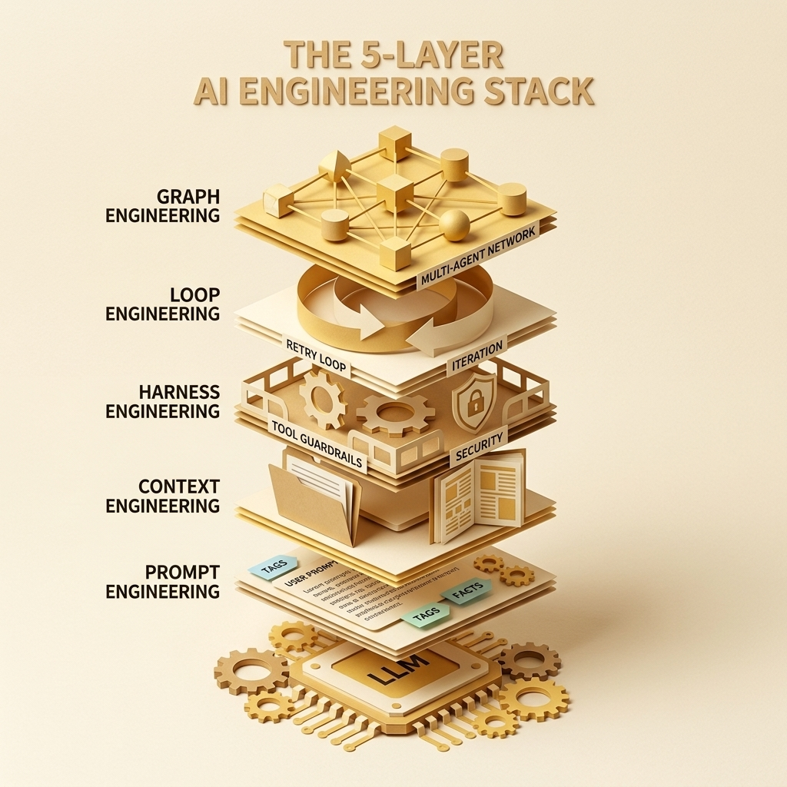
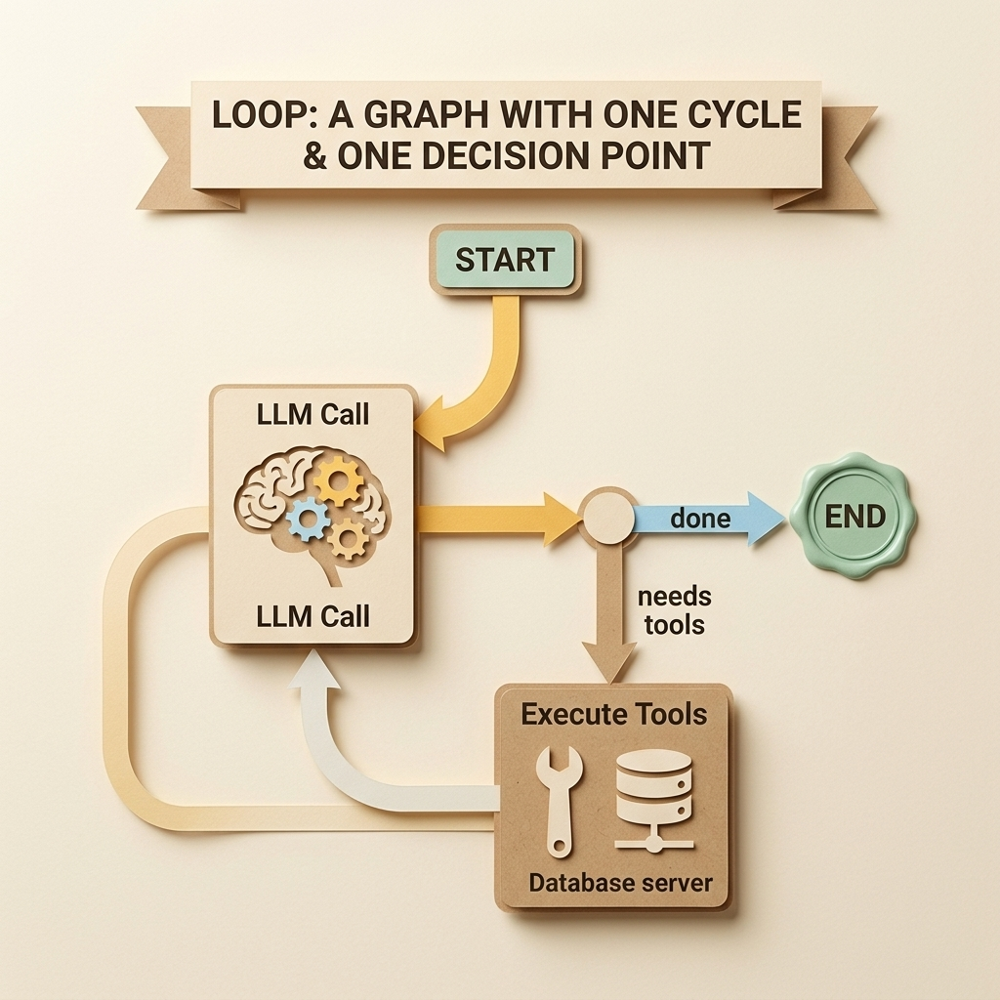
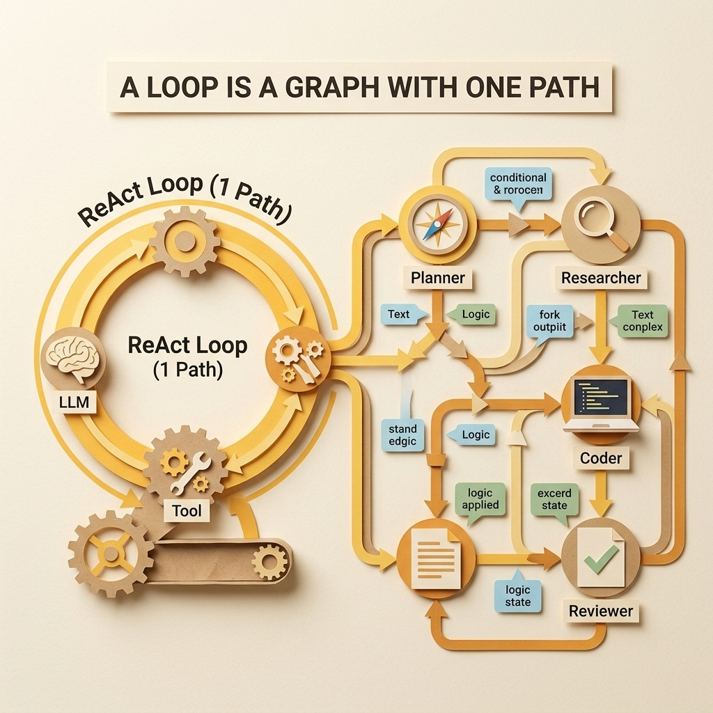
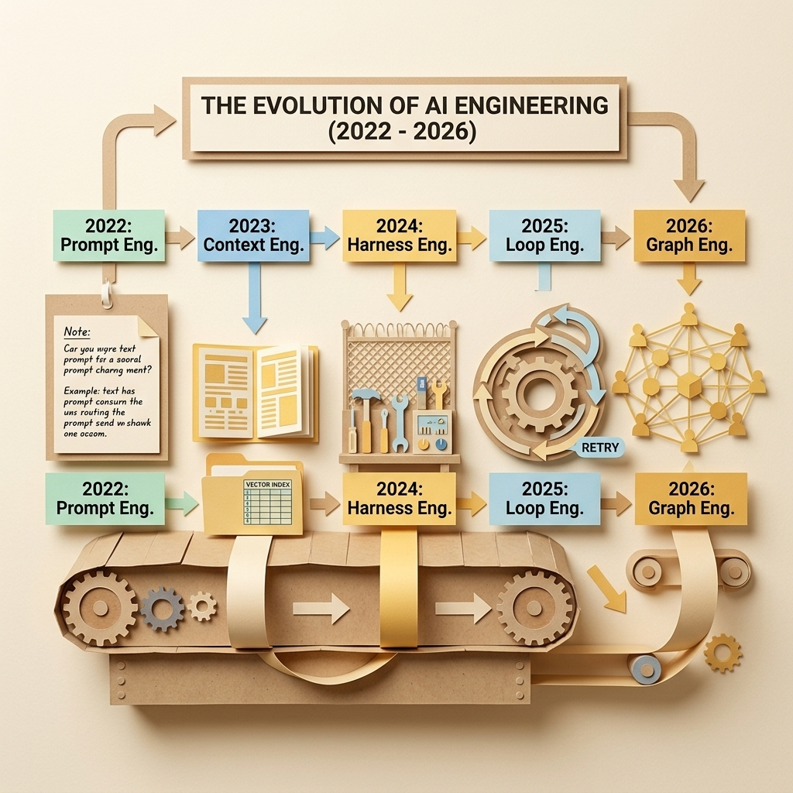
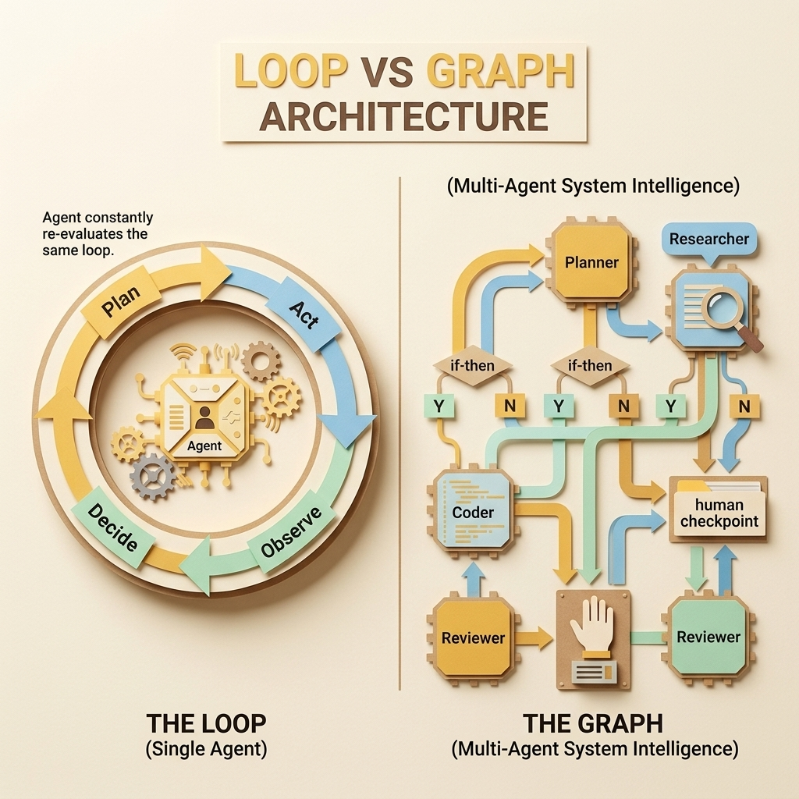
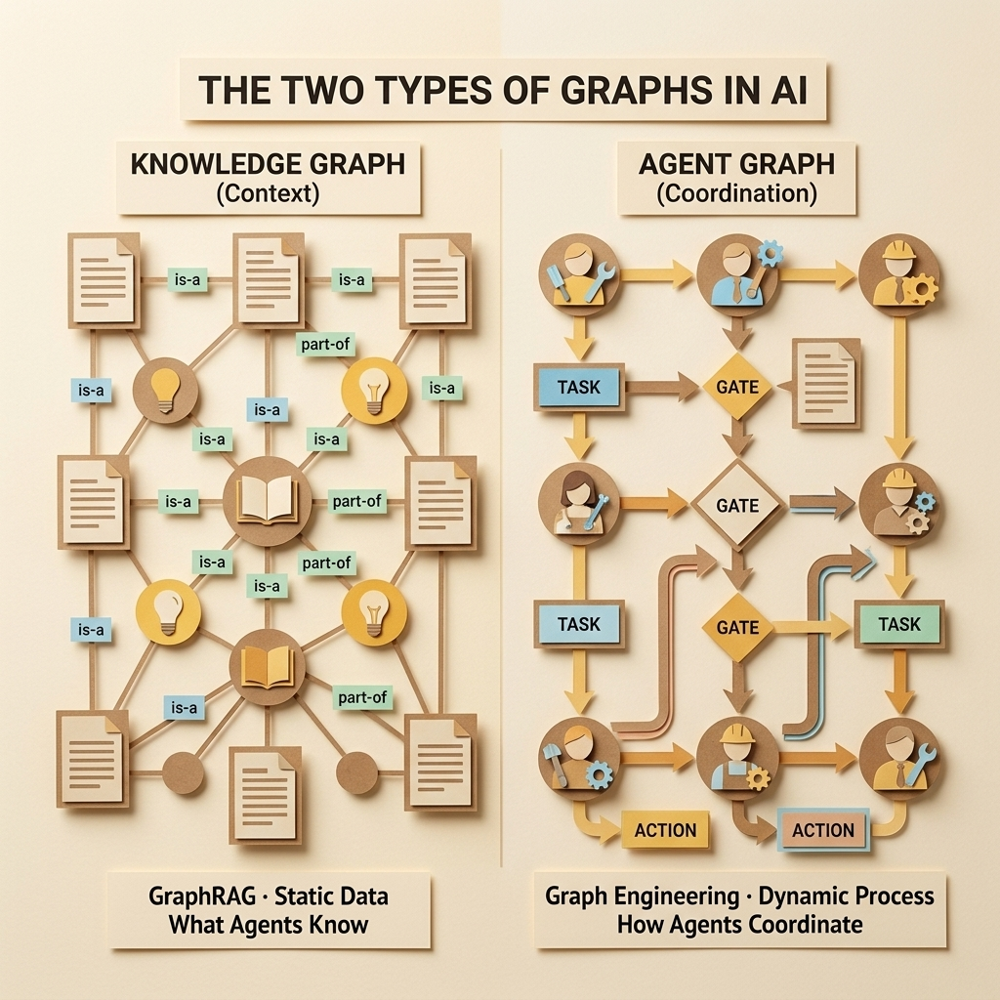
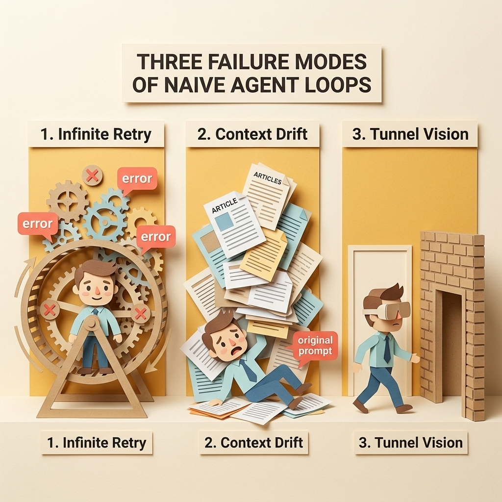
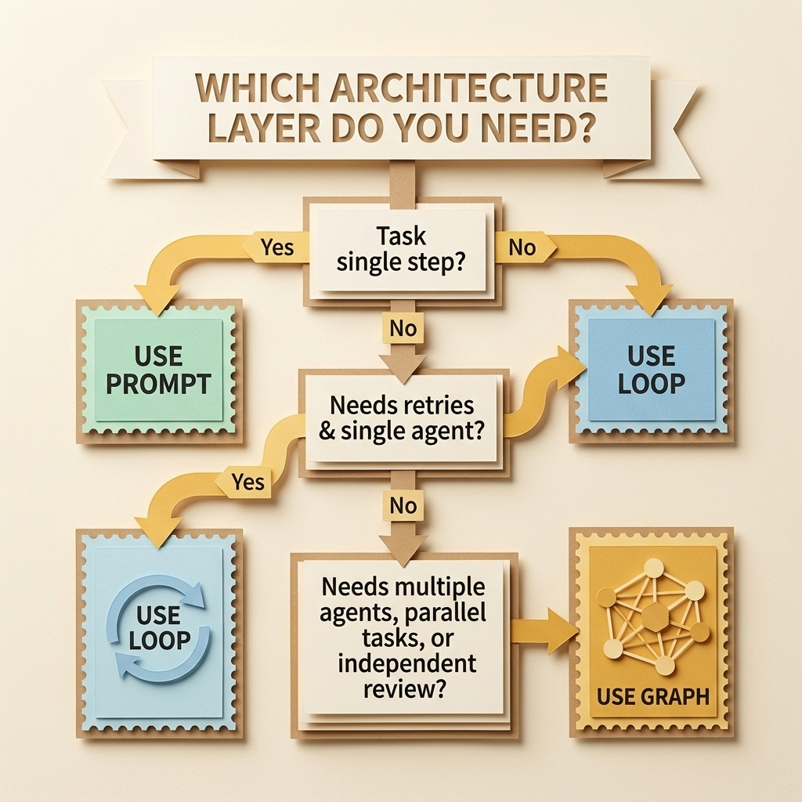

# From Loops to Graphs: The New Architecture of AI Agents

[](https://www.python.org/)
[](https://github.com/langchain-ai/langgraph)
[](https://arxiv.org/abs/2608.21156)
[](https://arxiv.org/abs/2608.21884)

Companion repository for the technical blog: **"From Loops to Graphs: The New Architecture of AI Agents"** by [Amarnath Byakod](https://medium.com/@abyakod).

---

## 🎯 The Core Thesis

> **"A loop is just a graph with one dominant path."**  
> Loop Engineering doesn't die when Graph Engineering arrives — it becomes a foundational primitive inside it.

When enterprise AI agents fail on complex workflows, teams frequently blame the underlying foundation model (GPT-5, GPT-6, Claude). In reality, **your agent didn't get dumber — your architecture hit its ceiling.**

```
Prompt Engineering → Context Engineering → Harness Engineering → Loop Engineering → Graph Engineering
```



---

## 📂 Repository Structure

```
├── code/
│   ├── loop_agent.py              # Production-grade ReAct loop with stop conditions & token budgets
│   └── graph_agent.py             # Multi-agent graph with LangGraph (Planner, Researcher, Coder, Reviewer)
├── images/                        # 8 custom 3D papercraft architecture diagrams
│   ├── 01_five_layer_stack.jpg
│   ├── 02_evolution_timeline.jpg
│   ├── 03_loop_vs_graph.jpg
│   ├── 04_two_graphs.jpg
│   ├── 05_failure_modes.jpg
│   ├── 06_decision_framework.jpg
│   ├── 07_loop_is_a_graph.jpg
│   └── 08_loop_single_cycle.jpg
├── requirements.txt
└── README.md
```

---

## 🚀 Quickstart

### 1. Clone & Install Dependencies

```bash
git clone https://github.com/abyakod/fromloops-graph.git
cd fromloops-graph
pip install -r requirements.txt
```

### 2. Run the ReAct Loop Agent

Demonstrates a single-agent loop equipped with **three explicit stop conditions** (token budget, completion check, and loop invariant guard) to prevent infinite retries:

```bash
export OPENAI_API_KEY="your-api-key"
export OPENAI_MODEL="gpt-5"  # Or "gpt-6"
python code/loop_agent.py
```

### 3. Run the Multi-Agent Graph

Demonstrates a **multi-agent LangGraph workflow** featuring typed shared state (`AgentState`), specialized agent roles (Planner, Researcher, Coder, Reviewer), and a conditional self-correction loop:

```bash
python code/graph_agent.py
```

*Note: `graph_agent.py` runs with simulated nodes out-of-the-box so you can inspect state transitions without requiring API credits.*

---

## 🎨 Architecture & Diagram Highlights

### 1. Loop as a Single Cycle Graph vs. Full Multi-Agent Graph
| Loop (1 Cycle, 1 Decision Point) | Multi-Agent Graph Orchestration |
| :---: | :---: |
|  |  |

### 2. The Evolution of AI Engineering (2022–2026)


### 3. Loop vs. Graph Architecture


### 4. The "Two Graphs" Trap: Knowledge Graph vs. Agent Graph


### 5. Three Failure Modes of Naive Loops


### 6. Decision Framework: Which Layer Do You Need?


---

## 📚 Academic References

1. **Graph Engineering in the Era of LLM Agents**  
   *Feng et al. (August 2026)* — [arXiv:2608.21156](https://arxiv.org/abs/2608.21156)  
   Formalizes Graph Engineering, system state schemas, and multi-agent coordination into "System Intelligence".

2. **Loop Engineering: Building Blocks, Adoption, and Impact**  
   *Lulla et al. (August 2026)* — [arXiv:2608.21884](https://arxiv.org/abs/2608.21884)  
   Large-scale empirical study of 36,710 repositories identifying the 6 core primitives of autonomous agent loops in production.

---

## ✍️ Author

**Amarnath Byakod**  
Solutions Architect & AI Systems Researcher  
- [Medium Profile & Technical Articles](https://medium.com/@abyakod)  
- Previous Article: *[Context Engineering and Knowledge Cataloging for AI Agents](https://medium.com/@abyakod/context-engineering-and-knowledge-cataloging-for-ai-agents-cf8a973a249d)*

---

## 📄 License

MIT License. Feel free to use the code, patterns, and diagrams in your own projects and publications.
